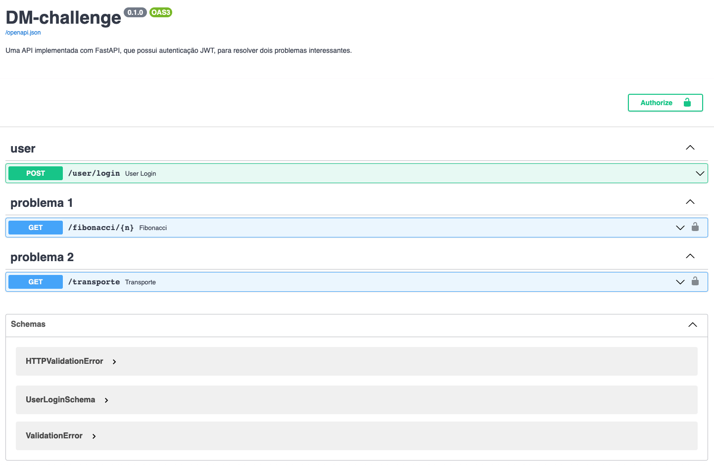

# DM-challenge



## Como utilizar a API
Clone o repositório:   
```
git clone https://github.com/igorkf/DM-challenge.git
```

Dentro da pasta do repositório, crie um arquivo chamado `.env`:
```
SECRET=...
ALGORITHM=...
USER_EMAIL=...
USER_PASS=...
```

Construa a imagem do Docker:
```
docker build -t my_api .
```

Defina o container:
```
docker run --env-file=.env --name my_container -p 8000:8000 my_api
```

### Autenticação

- Acesse http://localhost:8000/docs    

- Faça o login na rota `/user/login`

- Copie o token gerado

- Use o token para testar as rotas dos problemas abaixo

## Problemas

### Problema 1
Encontre o n-ésimo elemento (considerando 0 como primeiro elemento) da sequência de Fibonacci, dado um número maior ou igual a 0.   
- `/fibonacci/{n}`

Obs.: a documentação retornará `null` para números muito grandes (maior do que aproximadamente 300 dígitos).   
Por exemplo, você pode checar diretamente no terminal o 100000˚ termo da sequência:   
```
curl -X 'GET' \
  'http://localhost:8000/fibonacci/100000' \
  -H 'accept: application/json' \
  -H 'Authorization: Bearer TOKEN'
```
Lembre-se de substituir `TOKEN` pelo token gerado na rota `/user/login`.   


### Problema 2
Encontre o melhor veículo para transportar uma lista de itens, agrupado por plataforma.   
- /transporte

OBS.: cada parâmetro pode receber uma lista de valores.    
Teste na documentação e veja como a API monta a *query string*.   
Por exemplo, poderíamos testar a rota usando 4 itens com características diferentes:   
```
curl -X 'GET' \
  'http://localhost:8000/transporte?largura=10&largura=30&largura=50&largura=43&altura=45.6&altura=32.4&altura=29.5&altura=12.3&espessura=10.2&espessura=23.5&espessura=32.6&espessura=18.3&peso=5.6&peso=1&peso=6&peso=10' \
  -H 'accept: application/json' \
  -H 'Authorization: Bearer TOKEN'
```
Resultado:
```
[
  {
    "plataforma": "Lala",
    "volume_total": 85257.07,
    "peso_total": 22.6,
    "veiculo_ideal": {
      "veiculo": "Fiorino",
      "largura_max": 188,
      "altura_max": 133,
      "espessura_max": 108,
      "peso_max": 500,
      "volume_max": 2700432
    }
  },
  {
    "plataforma": "Ogi",
    "volume_total": 85257.07,
    "peso_total": 22.6,
    "veiculo_ideal": {
      "veiculo": "SUV",
      "largura_max": 125,
      "altura_max": 80,
      "espessura_max": 60,
      "peso_max": 200,
      "volume_max": 600000
    }
  }
]
```


